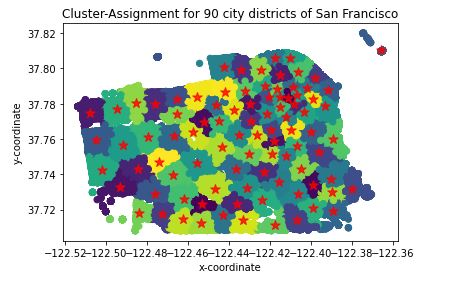

# San Francisco Crime Classification
 by Noah Lichtencker (lichtnoah), Gabriel Nobel (yingrjimsch), Rebekka von Wartburg (vonwareb)


## Introduction
During twelve weeks, we were shown the basic tools of machine learning in the Machine Learning and
Data Mining module. In numerous practical courses, we were able to get to know the individual
"tools" by getting hands on fictitious examples. Now we get the chance to prove our skills on real data.

## Our Challenge
Our task is to use a dataset of 12 years of crime reports to predict the correct type of crime in San Francisco.
After we received the task, however, the questions then arose very quickly:

* What types of data are we talking about?
* What does the data look like?
* What classifier is the best for this scenario?
* What data missing data would be usefull?


## Data - Analysis

From [Kaggle](https://www.kaggle.com/competitions/sf-crime/ "kaggle") and by looking at the content of the data the following information could be obtained:

* **Category** &#10132; Name (Category) of the incident, our Variable to predict as string representation
  * ✔️ USED. Key data and our "Y" Value to be found out.
* **Dates** &#10132;  Timestamp of the crime incident
  * ✔️ USED. Can be relevant (e.g. more crime in a specific month)
* **Descript** &#10132; A description of the incident. (This feature is only available in the training data)
  * ❌ NOT USED. Not decisive enough, hard to categorize, not in the test data
* **DayOfWeek** &#10132; the day of the week as string representation
  * ✔️ USED. Can be relevant (e.g. more crime on weekends)
  
  
* **PdDistrict** &#10132; Name of the Police Department District)
  * ✔️ USED. A sort of "clustering" can be very relevant
  
* **Resolution** &#10132; Resolution of the incident. How was the crime solved (This feature is also only available in the training data)
  * ❌ NOT USED. Not decisive enough, hard to categorize, not in the test data
* **Address** &#10132; Approximate street address of the incident as string representation
  * ✔️ USED. Can be relevant (e.g. could tell if inside or outside a building)
* **X** &#10132; Geographical longitude
  * ✔️ USED. Can be relevant (e.g. comparison with PdDistricts)
* **Y** &#10132; Geographical latitude
  * ✔️ USED. Can be relevant (e.g. comparison with PdDistricts)

## Preprocessing

### Error- Detection
Now that it was clear what kind of data is needed, outliers or corrupted data had to bee found. This makes the model building much smoother and reduces negative suprises.
1. **Checking for NULL Values &#10132;** no NULL values have been found 🥳
```python
In << df_train_origin.isnull().sum()

Out >> Dates         0
       Category      0
       Descript      0
       DayOfWeek     0
       PdDistrict    0
       Resolution    0
       Address       0
       X             0
       Y             0

```
2. **Checking for outliers &#10132;** Since San Francisco is the latitude 37.7562° and the longitude -122.4430° it could be determined very quickly that there are `67` outliers in the training data.
These are very few wrong values in relation to the whole dataset. Therefore we decided to delete them.
If there had been more data, we could have tried to replace them, for example, with an average value.
```python
In << ((df_train_origin.X.min(),   df_train_origin.X.max(),
         df_train_origin.Y.min(), df_train_origin.Y.max()))

Out >> (-122.51364206429, -120.5, 37.7078790224135, 90.0)

In << sum = 0
for i in df_train_origin.index:
    if df_train_origin["Y"][i] > 37.9:
        sum +=1

Out >> 67

```
3. **Checking for duplicate record &#10132;** A total of `2323` duplicates were identified in the data, which were also removed from the data set.
```python
In << len(df_train_origin[df_train_origin.duplicated()])

Out >> 2323
```

### Data- Preparing
With the acquired knowledge from class that a classifier can only deal with numerical values, we tried to convert the individual features into clever numerical values.
But what are suitable numerical values? Can features be split up to extract new features?
Should individual features be combined to obtain the greatest benefit?
Or could even additional, external features be added?

* Removing description and resolution: Because it is only available in the training data. This makes the features useless for a good test result.
* Visualtizing the data with different plots (e.g. Bar plots, seaborn heatmaps, Wordcloud): With this inspections could be made to determine which features have the most relevance.
* Clustering of X and Y Data (KMeans): This helped to be more accurate than the PdDistricts. The Cluster Centroids were used as new X and Y coordinates per data point to normalize as we've learned it. Thanks to internet research it was first tried to take 90 Clusters (for every neighbourhood in the golden city) [1] 



As a result, it was decided to use the elbow method to obtain an appropriate number of centers. A number of 5 clusters was considered optimal.


After that the new Clustered X and Y coordinates of the centroids where used instead of the original X and Y coordinates.

* Split date in year, month, quarter, hour
* Additional binary feature if weekday or weekend
* PdDistricts are split into binary columns.
* In the USA, addresses get categorized in different blocks or streets. Therefore the address column was split into a binary value block or not.
* Added weather data (temperature and weather conditions) in the hope it has correlations with which are "Good Weather" and which are "Bad Weather" crimes.


## Models

### RandomForest
Random Forest seemed a good fit to predict and evaluate our data and can have similar results to a Neural Network.
* **Characteristics**: To test the RandomForest for our data we chose a max depth of 27 (for each feature one depth deeper) and a total of 150 trees to go over the data.
* **Training**: 27 depth seemed inefficient. so we tried decreasing the depth to see which depth returned the best log loss. The score was best with a depth of 21
* **Evaluation**: In the end the random forest was inferior to our NN solution. We could have probably gone to a similiar score with more estimator trees, but that would have taken a longer processing time that a Neural Network could achieve.

### Support Vector Classifier
Support Vector Machine is a classical classifier and with help of the kernel trick it should allow us to classify complex data.
* **Characteristics**: A support vector classifier with the "rbf" kernel trick was chosen. In addition, the class weights were set to balanced and the probability for the log loss was switched on.
* **Training**: During the training it was noticed that SVC is not suitable for large data sets, because the training complexity is very high. Most of the data that were successfully trained were *5000* with a log loss of *~2.95*.
* **Evaluation**: It quickly became clear that an SVC was not capable of handling this task. Not only because the training takes so long but also because one would have to predict in batches to be able to evaluate the test data.

### Neural Network
* **Characteristics**: 

```python
model.compile(loss="sparse_categorical_crossentropy", optimizer="adam")
```

```python
from keras.callbacks import EarlyStopping, LearningRateScheduler
early_stopping = EarlyStopping(
    monitor="val_loss",
    mode="min",
    patience=10,
)
```
```python
initial_learning_rate = 0.01
epochs = 100
decay = initial_learning_rate / epochs

def lr_time_based_decay(epoch, lr):
    return lr * 1 / (1 + decay * epoch)

history = model.fit(
  x_train,
  y_train,
  batch_size=200,
  epochs=100,
  verbose=1,
  validation_split=.2,
  callbacks=[early_stopping, LearningRateScheduler(lr_time_based_decay, verbose=1)]
)

```

* **Training**: The first achieved score was 2.37, which was very promising. After trying to hand in the predicted results of the model, we realised that the model does not predict in probabilities, even tho "softmax" was used for the final activation and "categorical_crossentropy" as a loss function. After an hour input from Mr. Pascal Sager and even more hours of tuning, we achieved a new model that sometimes spits out probabilities but with a much worse score. The Problem of the binary output was because of the given class weights and the "One Hot Encoding" of our Y.


```python
from keras.models import Sequential
from keras.layers import Input, Flatten, Dense, Dropout, BatchNormalization

model = Sequential()

#220, 110, 0.2
model.add(Input(shape=X_df_train.shape[1]))
model.add(Dense(512, activation='relu'))
model.add(BatchNormalization())
model.add(Dropout(rate=0.5))
model.add(BatchNormalization())
model.add(Dense(256, activation='relu'))
model.add(BatchNormalization())
model.add(Dropout(rate=0.5))
model.add(BatchNormalization())
model.add(Dense(128, activation='relu'))
model.add(Dropout(rate=0.2))
model.add(BatchNormalization())
model.add(Dense(39, activation='softmax'))

model.summary()

```


```python
from sklearn.utils import class_weight
class_weight = class_weight.compute_class_weight(class_weight='balanced', classes=np.unique(Y_df_train[0]), y=Y_df_train[0])
class_weight = {v: k for v, k in enumerate(class_weight)}
class_weight
```

```python
from keras.utils import to_categorical
Y =  to_categorical(
    Y_df_train[0], num_classes=None, dtype='float32'
)
```

* **Evaluation**: The neural network seemed to perform and score best in the first training stage. We Uploaded a few times to [Kaggle](https://www.kaggle.com/competitions/sf-crime/ "kaggle") and scored a 3.67 as a final result.

## Results

While the process of data analysing, choosing a model and trying to improve it was enjoyable for our team. The troubleshooting and not understanding certain side effects and details of keras handling was a little bit frustrating in the end (see Neural Network training). 

In the image below you can see our final [Kaggle](https://www.kaggle.com/competitions/sf-crime/ "kaggle") score:


## What's next?
If there were more time, the next steps would be to try to understand our probability problem completely and solve it. After that, we would try to optimize the class weightings, since they might not fit the test data. Finally, we could generate new features, feature combinations or more data, so that the neural network can be trained more optimally. 

## References

[1] [https://de.frwiki.wiki/wiki/Liste_des_quartiers_de_San_Francisco](https://de.frwiki.wiki/wiki/Liste_des_quartiers_de_San_Francisco)
